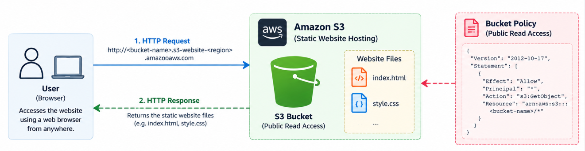

# Hosting a static website on Amazon S3. This is version 1.

## Architecture



## Version 1 — Static Website Hosting with Amazon S3

A personal developer portfolio built with HTML and CSS and deployed
as a static website using Amazon S3.

The goal of V1 was to understand the fundamentals of Amazon S3,
static website hosting, AWS permissions, bucket policies,
Git/GitHub, and manual cloud deployment.

---

##  Project Objectives

- Build a responsive personal portfolio using HTML and CSS.
- Track the project locally using Git.
- Store the source code in GitHub.
- Create and configure an Amazon S3 bucket.
- Deploy website files manually to Amazon S3.
- Configure S3 Static Website Hosting.
- Understand S3 public access controls.
- Create a least-privilege bucket policy for public website access.
- Make the portfolio accessible through an S3 website endpoint.

---
## Technologies Used

### Frontend

- HTML5
- CSS3
- Google Fonts
- Responsive CSS

### AWS

- Amazon S3
- S3 Static Website Hosting
- S3 Bucket Policies
- SSE-S3 encryption
- AWS resource tagging

### Development & Version Control

- Visual Studio Code
- Git
- GitHub
- GitHub Desktop

---

## Architecture

The V1 architecture uses Amazon S3 directly as the static website host.

Developer
    |
    | HTML / CSS
    v
VS Code
    |
    | Git commit
    v
Local Git Repository
    |
    | Git push
    v
GitHub Repository
    |
    | Manual deployment
    v
Amazon S3
    |
    | Static Website Hosting
    v
S3 Website Endpoint
    |
    v
Internet User

GitHub stores the source code and its version history, while
Amazon S3 hosts the files that are delivered to website visitors.

---

## AWS Configuration

### Region

Asia Pacific (Mumbai) — `ap-south-1`

### S3 Bucket

A general-purpose S3 bucket was created to store the static
website assets.

The deployed objects currently include:

- `index.html`
- `style.css`

### Object Ownership

Object Ownership was configured as:

`Bucket owner enforced`

ACLs were disabled, allowing access control to be managed using
bucket policies instead of individual object ACLs.

### Public Access

S3 Block Public Access was disabled intentionally for V1 because
the S3 static website endpoint requires the website objects to
be publicly readable.

Public permissions were restricted to read-only object access
using `s3:GetObject`.

### Versioning

Bucket versioning was disabled for V1.

Source-code history is maintained using Git.

### Encryption

Default server-side encryption using Amazon S3 managed keys
(SSE-S3) is enabled.

### Resource Tagging

The S3 bucket was tagged:

`Project = Cloud-Portfolio`

---

## Bucket Policy

The following bucket policy provides public read-only access
to the website objects:

```json
{
  "Version": "2012-10-17",
  "Statement": [
    {
      "Sid": "PublicReadGetObject",
      "Effect": "Allow",
      "Principal": "*",
      "Action": "s3:GetObject",
      "Resource": "arn:aws:s3:::abhra-cloud-portfolio-2026/*"
    }
  ]
}
```
## Security Considerations

- ACLs are disabled.
- Bucket Owner Enforced object ownership is enabled.
- Public access is restricted to `s3:GetObject`.
- No public write or delete permissions are granted.
- SSE-S3 encryption is enabled.
- No AWS credentials or secrets are stored in GitHub.