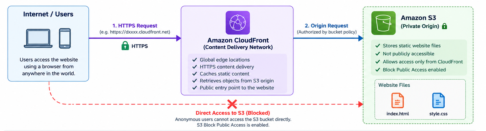

# Version 2 — CloudFront CDN with Private Amazon S3 Origin

## Architecture



## Overview

Version 2 evolves the original Amazon S3 static website into a more secure content-delivery architecture using Amazon CloudFront.

In Version 1, the portfolio was served directly from the Amazon S3 static website endpoint and the website objects required public read access.

In Version 2, Amazon CloudFront acts as the public entry point while the S3 bucket is configured as a private origin. Users access the website through CloudFront over HTTPS, while direct public access to the S3 objects is blocked.

---

## Architecture

```text
                    Internet User
                          |
                          | HTTPS
                          v
                 +-----------------+
                 | Amazon          |
                 | CloudFront CDN  |
                 +--------+--------+
                          |
                          | Authorized origin request
                          v
                 +-----------------+
                 | Amazon S3       |
                 | Private Origin  |
                 +-----------------+
                    |           |
                    v           v
                index.html   style.css


Internet User -------- X --------> Amazon S3
                    Direct access
                       denied
```

---

## Architecture Components

### Amazon CloudFront

Amazon CloudFront is used as the public content delivery layer.

Responsibilities:

- Provides the public website endpoint.
- Serves the website over HTTPS.
- Caches static content at AWS edge locations.
- Retrieves website objects from the S3 origin.
- Acts as the only intended public entry point to the website.

### Amazon S3

Amazon S3 stores the static website assets:

- `index.html`
- `style.css`

Unlike Version 1, the bucket is no longer publicly readable.

The S3 REST endpoint is configured as the CloudFront origin rather than using the S3 static website endpoint.

---

## Request Flow

1. A user requests the portfolio using the CloudFront domain.
2. The browser establishes an HTTPS connection with CloudFront.
3. CloudFront checks whether the requested object is available in its cache.
4. If CloudFront needs the object from the origin, it sends an authorized request to Amazon S3.
5. The S3 bucket policy permits the CloudFront distribution to perform `s3:GetObject`.
6. Amazon S3 returns the requested object to CloudFront.
7. CloudFront delivers the content to the user.
8. Subsequent requests may be served from CloudFront's cache.

---

## Security Design

### Private S3 Bucket

Version 1 contained a public read permission using:

```json
{
  "Principal": "*",
  "Action": "s3:GetObject"
}
```

This permission was removed in Version 2.

Anonymous internet users can no longer retrieve the website objects directly from S3.

### CloudFront Access to S3

The S3 bucket policy grants `s3:GetObject` to the CloudFront service principal:

```json
{
  "Principal": {
    "Service": "cloudfront.amazonaws.com"
  },
  "Action": "s3:GetObject"
}
```

Access is further restricted using an `AWS:SourceArn` condition associated with the specific CloudFront distribution.

This ensures that the permission is not granted to arbitrary CloudFront distributions.

> Account-specific identifiers and the complete production bucket policy are intentionally omitted from this documentation.


### S3 Block Public Access

S3 Block Public Access is enabled.

This provides an additional safeguard against accidentally exposing the bucket publicly.

The resulting access model is:

```text
Internet -> CloudFront -> S3    ALLOWED

Internet -------------> S3     DENIED
```

---

## HTTPS

Users access the portfolio through the CloudFront domain using HTTPS.

This improves upon Version 1, where the native S3 static website endpoint was used directly.

```text
Browser
   |
   | HTTPS
   v
CloudFront
```

---

## Default Root Object

The CloudFront distribution uses:

```text
index.html
```

as its default root object.

Therefore a request to:

```text
https://<cloudfront-domain>/
```

is mapped to the portfolio's `index.html` object.

---

## Caching

CloudFront caches static website assets at edge locations.

Conceptually:

```text
First request

User
  |
  v
CloudFront
  |
  | Cache miss
  v
Amazon S3


Subsequent request

User
  |
  v
CloudFront
  |
  | Cache hit
  v
Cached Content
```

This reduces repeated requests to the S3 origin and provides the foundation for globally distributed content delivery.

---

## Validation

The architecture was validated using two access paths.

### Test 1 — CloudFront

The portfolio was accessed through the CloudFront HTTPS endpoint.

**Result: SUCCESS**

The HTML and CSS were successfully retrieved and the website rendered correctly.

### Test 2 — Direct S3 Website Access

After removing the public-read bucket policy, the original S3 website endpoint was tested.

**Result: ACCESS DENIED**

S3 Block Public Access was subsequently enabled while the website remained accessible through CloudFront.

This verified that CloudFront had become the intended public entry point while the S3 origin remained private.

---

## Technologies and AWS Services

- HTML5
- CSS3
- Amazon S3
- Amazon CloudFront
- Resource-based policies
- HTTPS protocol
- Git
- GitHub
- Visual Studio Code

---

## Key Learnings

This version provided hands-on experience with:

- Amazon CloudFront distributions
- Content Delivery Networks (CDNs)
- CloudFront origins
- Edge caching
- Private S3 origins
- S3 REST endpoints vs S3 website endpoints
- Resource-based S3 bucket policies
- AWS service principals
- Restricting access using `AWS:SourceArn`
- S3 Block Public Access
- HTTPS content delivery
- CloudFront default root objects
- Validating public and private access paths
- Improving an existing cloud architecture rather than rebuilding from scratch

---